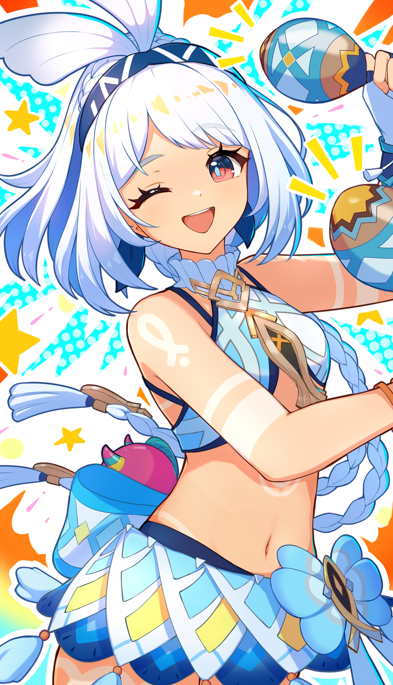

| 本名 | 中：玛拉妮 英：Mualani 日：ムアラニ 韩： |
| ---- | --------------------------------------------------- |
| 别号 |                                                     |
|      |                                                     |
| 生日 | 8 月 3 日                                           |
|      |                                                     |
|      |                                                     |
|      |                                                     |
|      |                                                     |
|      |                                                     |
|      |                                                     |

# 角色经历

## 第五章 第一幕「荣花与炎日之途」

认识了被卡齐娜带来的旅行者与派蒙，与基尼奇共三人介绍了圣火竞技场、「巡夜者战争」与「归火圣夜巡礼」等。她试图邀请旅行者参赛，规则却不允许。随后预备参加比赛，鼓励了卡齐娜，约定第二天会合。

比赛开始后与卡齐娜一同完成了团体赛。最后一轮个人赛时，因为与卡齐娜分数接近，两人成为对手。激烈对决过后，玛拉妮以微弱劣势输给了卡齐娜，乐观地接受了卡齐娜的胜利，对她参加巡夜者战争感到略有担心。抢先基尼奇「悬木人」部族的邀请，先一步邀请旅行者去自己的部族「流泉之众」玩。

来到「流泉之众」，玛拉妮的邻居伽娅阿姨表明，外来者要先经过人工温泉的「试炼」才能证明自己不会被天然温泉烫伤，并提到天然温泉近期的不稳定预示着深渊的动荡。随后玛拉妮提到阿伽娅曾经被深渊魔物刺穿腹部，因此不能泡温泉，否则会加速深渊力量侵蚀心脏。在带旅行者前去人工温泉的途中，遇到了「流泉之众」首领阿米娜、希库埃鲁和马洛考谈论见到阿伽娅泡荒废温泉的事，决定待会会面，改造它为阿伽娅办聚会。随后便带旅行者和派蒙去更衣间换上泳装，在人工温泉中浸泡。阿伽娅前来指责了准备在温泉中游泳的玛拉妮，并带来了牛奶和点心，认可旅行者和派蒙去天然温泉没有风险。阿伽娅提到了玛拉妮小时候因为不喜欢牛奶将其倒入温泉中十分明显的故事。泡完温泉，旅行者主动提出要帮忙准备温泉聚会。布置完成后玛拉妮送旅行者到旅馆休息。

当晚，流泉之众部族突然遭到深渊魔物突袭，玛拉妮和旅行者等人奋勇抵抗，发现深渊魔物现身的深渊界门竟出现在了荒废温泉处，阿伽娅率先赶到封印了深渊界门，但也因此被深渊侵蚀，就在玛拉妮等人急切万分之际，旅行者想起自己曾净化过被深渊侵蚀的特瓦林的泪滴，因此如法炮制消除了阿伽娅身上的深渊侵蚀，但却也发现一部分侵蚀已经深入她的内脏，再也无法清除——换言之，阿伽娅的死期即将到来。

次日，众人如同计划好的那般在荒废温泉为阿伽娅举办了聚会，途中阿伽娅单独叫出旅行者和玛拉妮，坦白了自己时日无多的事实，玛拉妮表示早有心理准备，阿伽娅告诉玛拉妮，自己很高兴在生命的最后一刻能与玛拉妮并肩作战，她对流泉之众的未来很放心，因为玛拉妮必将让大家团结在一起，玛拉妮接受了阿伽娅的临终托付，以及帮助阿伽娅将她的护身符转交给玛薇卡的请求。

## 第五章 第二幕「黑石湮落白石下」

玛拉妮得知参加巡夜者战争的众人已成功获胜，但是卡齐娜成为了此次战役中唯一的牺牲者，玛拉妮、旅行者等人赶去圣火竞技场，为胜者庆贺的同时也为逝者歌唱「还魂曲」以将其复活，但是还魂曲过后，卡齐娜竟并未复活，圣火中并未寻到卡齐娜的古名，玛拉妮相当惊讶。曾败给卡齐娜的两个参赛选手当场起哄称卡齐娜没有获得被大灵承认的胜利，人群议论纷纷，玛拉妮对这两个人的污蔑相当愤慨，与二人争辩，玛薇卡喝止了那两个小人的无端质疑行为，表示卡齐娜无法复活的原因正在调查中，玛拉妮急切地撞开刚才那两人，表示不能接受「情况还在调查」的说法，玛薇卡便邀请玛拉妮一同来想办法解救卡齐娜，同时在场的旅行者和派蒙也受到了玛薇卡的邀请。

玛薇卡与旅行者、派蒙、玛拉妮、基尼奇、伊安珊和恰斯卡一同商议现状，她安抚了悲伤愤怒的玛拉妮，并交代了现状：深渊找到了新的手段将要破坏纳塔的规则，如果继续进行归火圣夜巡礼和巡夜者战争会出现更多的受害者，而如果停止这两项活动纳塔的圣火会逐渐熄灭，深渊袭击各部族的次数也会愈加频繁。玛拉妮意识到卡齐娜被深渊挟持作了人质，得知拯救卡齐娜的办法只有亲自进入夜神之国，玛拉妮毅然决然地同意前往。玛拉妮将阿伽娅的护身符转交给了玛薇卡，玛薇卡从中感受到阿伽娅的生命即将走到尽头。

玛拉妮等人在悬木人部族找首领瓦伊纳借来灵觉髓石，又请来传奇侦查师维查玛帮助他们从地脉中提取出了卡齐娜的古名，一切准备妥当后，众人前往竞技场的话事处，通过卡齐娜的古名与深处夜神之国中的卡齐娜取得了联系，卡齐娜担心因为自己的弱小而连累到旅行者、玛拉妮等人，玛拉妮斥责了卡齐娜总是自我否定的想法，希望卡齐娜相信自己的能力，表示一定会来救她，卡齐娜终于难以掩盖内心的绝望，大哭了起来。玛拉妮等人进入夜神之国，解救了被魔物追逐的卡齐娜，在卡齐娜的请求下前往已经被完全侵蚀的大灵处，在此遭遇了一直追杀卡齐娜的深渊咏者科莫奎，科莫奎嘲笑了依旧相信着玛薇卡的众人，和在他眼里弱小的卡齐娜，玛拉妮反驳了科莫奎的妄语，强调了团结的重要性，卡齐娜振作了起来，和玛拉妮一起对战科莫奎并成功将其击杀。

众人净化了被深渊力量侵蚀的大灵，同时玛拉妮也因为帮助卡齐娜对抗深渊的蛊惑，作为代表流泉之众的六英雄之一觉醒了，见到了先代英雄「巨人」图帕克的幻影并得到了他的认可。众人试图逃离即将被深渊完全侵吞的夜神之国，就在出口关闭、众人束手无策之际，玛薇卡及时出手，打破了夜神之国的空间并解救了众人，标志着营救卡齐娜行动的成功。玛薇卡告知了纳塔即将毁灭，玛拉妮将作为英雄之一与其他五个部族的五位英雄一起拯救纳塔。

当晚，玛薇卡为卡齐娜专门举办了一场庆功宴，玛拉妮自然也参与了这次宴会，不过得知自己使命后的玛拉妮并不像先前那么活泼，但在被旅行者和派蒙开导，以及看到被众人簇拥的卡齐娜后，玛拉妮还是决定开心一些，并把宴会的气氛带起来，于是起身加入了众人，邀请卡齐娜一起跳舞。
